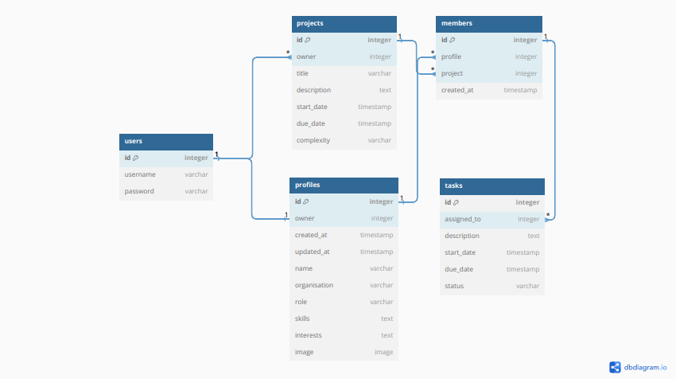

# Smart Work API
## ⚠️ARCHIVED PROJECT

**This is an archived project from my bootcamp with [Code Institute](https://codeinstitute.net) in 2023, kept for historical reference. It does not represent my current skill level or tech stack.**
Smart Work is a project manager app built using the Javascript React framework. The app uses an API created with the Django-Rest Framework to load, create, edit, and delete data. The purpose of the site is to collaborate on projects with colleagues or friends, where users can add, update and delete tasks from projects, as well as view users' profiles and customize their own. The app is split into two separate sites. This repository is the back-end API section of the app.

## Live Site
[https://smart-work-api.onrender.com/](https://smart-work-api.onrender.com/)
#### Front End Site
[https://smart-work-3d4938feb378.herokuapp.com/](https://smart-work-3d4938feb378.herokuapp.com/)
[https://smart-work.onrender.com/](https://smart-work.onrender.com/)
## Repository
[https://github.com/AlexSmall96/Smart-Work-API](https://github.com/AlexSmall96/Smart-Work-API)
#### Front End Repository
[https://github.com/AlexSmall96/Smart-Work](https://github.com/AlexSmall96/Smart-Work)
## Table of Contents
- [Smart Work API](#smart-work-api)
  * [Live Site](#live-site)
      - [Front End Site](#front-end-site)
  * [Repository](#repository)
      - [Front End Repository](#front-end-repository)
  * [Table of Contents](#table-of-contents)
    + [Database Schema](#database-schema)
  * [Testing](#testing)
    + [Manual Testing](#manual-testing)
    + [Validation Testing](#validation-testing)
  * [Deployment](#deployment)
    + [Deploying the Site to Heroku](#deploying-the-site-to-heroku)
    + [Forking the Repository on GitHub](#forking-the-repository-on-github)
    + [Cloning the Repository on GitHub](#cloning-the-repository-on-github)
  * [Credits](#credits)
    + [Content](#content)
    + [Other programs used](#other-programs-used)
  * [Acknowledgements](#acknowledgements)
### Database Schema
The below diagram was used to plan the database schema.

 

## Testing
### Manual Testing
Manual testing was carried out and documented in the below pdf. For each of the site models, the list and detail views were tested along with any filtering methods. In the below document, 'Base URL' refers to the main URL of the site.

[Testing](documentation/testing/apiTesting.pdf) 
### Validation Testing 
All .py files pass through the [Code Institute Python Linter](https://pep8ci.herokuapp.com/) with no issues.
## Deployment
### Deploying the Site to Heroku
1. First create a database instance on https://www.elephantsql.com/
    - Navigate to ElephantSQL.com and click “Get a managed database today”
    - Select “Try now for FREE” in the TINY TURTLE database plan
    - Select “Log in with GitHub” and authorize ElephantSQL with your selected GitHub account
    - In the Create New team form:
        - Add a team name (your own name is fine)
        - Read and agree to the Terms of Service
        - Select Yes for GDPR
        - Provide your email address
        - Click “Create Team”`
    - Once logged in, click 'Create New Instance'
    - Select a plan and name (this is usually the name of the project)
    - Click select region and select the region closest to you
    - Click review and create instance
    - Once created, go to the dashboard, click on the database name, and copy the URL
2. Create an account on [https://cloudinary.com/](Cloudinary) and copy the CLOUNDARY_URL from the dashboard
3. On Heroku.com, click Create New App, and create using any name
4. Go to the settings tab, click reveal config vars, and add the following key, and value pairs:
    - CLIENT_ORIGIN: this is the URL of the deployed front-end site
    - CLOUINARY_URL: the URL copied from Cloudinary
    - DATABASE_URL: the database copied from Elephant SQL
    - DISABLE_COLLECTSTATIC: set to 1
    - SECRET_KEY: any value will do
5. Open a new workspace from this repository and install any necessary packages from the requirements.txt file
6. Create an env.py file and add the lines (if committing to GitHub ensure env.py is in the .gitignore file)
    - import os 
    - os.environ['DATABASE_URL'] = 'your_database_url'
7. Enter the command 'python manage.py migrate'. This will migrate the database structure into your newly created database.
8. Go back to Heroku and click deploy. Copy the URL of the deployed site
9. Go back to the Heroku app and add a final config var of: ALLOWED_HOST with the value being the URL you just copied
10. Click open app to view the API.

### Forking the Repository on GitHub
1. On GitHub.com, navigate to the main page of the repository.
2. In the top-right corner of the page, click Fork.
3. Select an owner for the forked repository.
4. By default, forks are named the same as their upstream repositories. You can change the name of the fork to distinguish it further.
5. Optionally, add a description of your fork.
6. Choose whether to copy only the default branch or all branches to the new fork. For many forking scenarios, such as contributing to open-source projects, you only need to copy the default branch. By default, only the default branch is copied.
7. Click Create Fork.
### Cloning the Repository on GitHub
1. On GitHub.com, navigate to the main page of the repository.
2. Above the list of files, click Code.
3. Copy the URL for the repository.
4. Open Terminal.
5. Change the current working directory to the location where you want the cloned directory.
6. Type git clone, and then paste the URL you copied earlier.
7. Press Enter to create your local clone.
## Credits
### Content
The site was built with inspiration from the Code Institute Moments and Django Rest Framework walkthrough projects. Several models have been created with the walkthrough projects as source material, however, custom code was required to deal with deviations in the site functionality and database schema.
### Other programs used
- [https://dbdiagram.io/home](https://dbdiagram.io/home) was used to create the database schema diagram.
## Acknowledgements 
This application was created as a portfolio 5 project for the Diploma in Full Stack Software Development from [Code Institute](https://codeinstitute.net/full-stack-software-development-diploma/?utm_term=code%20institute&utm_campaign=CI+-+UK+-+Search+-+Brand&utm_source=adwords&utm_medium=ppc&hsa_acc=8983321581&hsa_cam=1578649861&hsa_grp=62188641240&hsa_ad=635720257674&hsa_src=g&hsa_tgt=kwd-319867646331&hsa_kw=code%20institute&hsa_mt=e&hsa_net=adwords&hsa_ver=3&gclid=CjwKCAiA5Y6eBhAbEiwA_2ZWIUE0LRewvfAYnQS69Lujb5s2FrQjmX0Idzqj-Olbamn1DbS2D-R7gBoC-1AQAvD_BwE
)
I would like to thank my mentor [Gareth McGirr](https://github.com/Gareth-McGirr ) for his encouraging support and detailed feedback throughout this project. I would also like to thank the tutor support team for their helpful advice.
